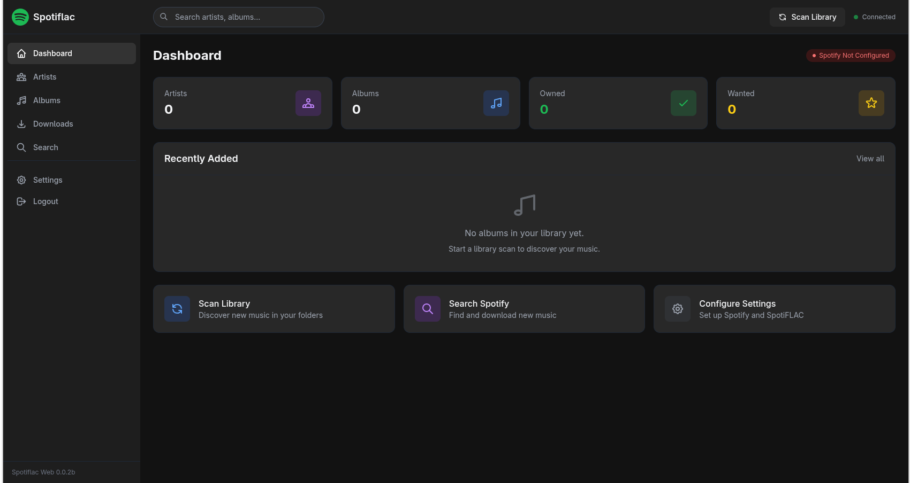

# Spotiflac web

A self-hosted web application for managing your music library with SpotiFLAC integration. Think of it as Lidarr, but specifically designed for high-quality FLAC downloads via SpotiFLAC.




## Quick Start

### Using Docker Compose

1. **Clone the repository**
   ```bash
   git clone https://github.com/NotLugozzi/Spotiflac-web
   cd spotiflac-autowatcher
   ```

2. **Configure environment**
   ```bash
   cp .env.example .env
   # Edit .env with your paths (Spotify API credentials are optional)
   ```

3. **Start the application**
   ```bash
   docker-compose up -d
   ```

4. **Access the web interface**
   ```
   http://localhost:8080
   ```

## Development prerequisites

1. **Prerequisites**
   - Python 3.11+
   - FFmpeg (for audio processing)

2. **Install dependencies**
   ```bash
   python -m venv venv
   source venv/bin/activate
   pip install -r requirements.txt
   ```

3. **Configure environment**
   ```bash
   cp .env.example .env
   # Edit .env with your settings
   ```

4. **Run the application**
   ```bash
   DEBUG=true python -m app.main
   ```

## Configuration

### Environment Variables

| Variable | Description | Default |
|----------|-------------|---------|
| `SPOTIFY_CLIENT_ID` | Spotify API Client ID (optional) | *(empty)* |
| `SPOTIFY_CLIENT_SECRET` | Spotify API Client Secret (optional) | *(empty)* |
| `MUSIC_LIBRARY_PATH` | Path(s) to scan for existing music | `/music` |
| `DOWNLOAD_PATH` | Path for downloaded files | `/downloads` |
| `SPOTIFLAC_SERVICE` | Services to use (comma-separated) | `tidal,qobuz,deezer` |
| `SPOTIFLAC_FILENAME_FORMAT` | Output filename template | `{artist}/{album}/{track_number} - {title}` |
| `SCAN_INTERVAL_MINUTES` | Auto-scan interval | `60` |
| `AUTO_SCAN_ON_STARTUP` | Scan library on startup | `true` |
| `AUTH_USERNAME` | Basic auth username (optional) | |
| `AUTH_PASSWORD` | Basic auth password (optional) | |
| `SECRET_KEY` | Session secret key | *replace the default string* |
| `LOG_LEVEL` | Logging level | `INFO` |

### Spotify API Credentials (Optional)

Spotify API credentials are **optional**. Without them, you can still:
- Download music using **Direct URL input** (paste Spotify URLs directly)
- Manage your existing local music library
- Scan and organize your music files

With Spotify API credentials, you get:
- Automatic artist/album matching from your local library
- Search integration to find new music
- Metadata fetching (album art, release dates, etc.)
- Complete discography discovery for artists

**To get credentials:**

1. Go to [Spotify Developer Dashboard](https://developer.spotify.com/dashboard)
2. Log in with your Spotify account
3. Click "Create app"
4. Fill in the app name and description
5. Copy the **Client ID** and **Client Secret**
6. Add them to your `.env` file

### Docker Volumes

| Volume | Purpose | Mount Point |
|--------|---------|-------------|
| `spotiflac_data` | Database persistence | `/app/data` |
| Your music library | Existing music files | `/music` (read-only) |
| Downloads folder | New downloads | `/downloads` |

your music library and the download folder can coexist in the same directory, if you want to avoid having to move or symlink things manually
## Usage

### Dashboard

The dashboard provides an overview of your library with:
- Statistics (artists, albums, owned, wanted)
- Active downloads with progress
- Recently added albums
- Quick actions (scan, search, settings)

### Artists

- View all artists in your library
- Click an artist to see their full discography
- Sync with Spotify to discover missing albums
- Monitor artists for automatic downloads

### Albums

- Browse all albums with filters (owned, wanted, missing)
- View album details with track listings
- Queue albums for download
- Mark albums as "wanted" for later

### Downloads

- View active download queue with progress
- Download history with retry options
- Real-time status updates

### Search & Direct URL Download

**With Spotify API configured:**
- Search your local library
- Search Spotify for new music
- Click "Download" on any search result

**Without Spotify API (or anytime):**
- Use the **Direct URL Download** section
- Paste any Spotify URL (album, track, artist, or playlist)
- Supports multiple URLs at once (one per line)
- URLs can be in any format:
  - `https://open.spotify.com/album/xxxxx`
  - `https://open.spotify.com/track/xxxxx`
  - `https://open.spotify.com/artist/xxxxx`
  - `https://open.spotify.com/playlist/xxxxx`
  - `spotify:album:xxxxx` (URI format)

## API Documentation

### Endpoints

#### Library

| Method | Endpoint | Description |
|--------|----------|-------------|
| GET | `/api/library/stats` | Get library statistics |
| POST | `/api/library/scan` | Start a library scan |
| GET | `/api/library/scan/status` | Get current scan status |
| GET | `/api/library/scan/history` | Get scan history |

#### Artists

| Method | Endpoint | Description |
|--------|----------|-------------|
| GET | `/api/artists` | List all artists |
| GET | `/api/artists/{id}` | Get artist details |
| GET | `/api/artists/{id}/albums` | Get artist's albums |
| POST | `/api/artists/{id}/sync` | Sync with Spotify |
| PATCH | `/api/artists/{id}` | Update artist settings |

#### Albums

| Method | Endpoint | Description |
|--------|----------|-------------|
| GET | `/api/albums` | List all albums |
| GET | `/api/albums/{id}` | Get album details |
| PATCH | `/api/albums/{id}` | Update album settings |
| POST | `/api/albums/{id}/refresh` | Refresh from Spotify |

#### Downloads

| Method | Endpoint | Description |
|--------|----------|-------------|
| GET | `/api/downloads/queue` | Get download queue |
| GET | `/api/downloads/history` | Get download history |
| POST | `/api/downloads` | Add album to queue |
| DELETE | `/api/downloads/{id}` | Cancel download |
| POST | `/api/downloads/{id}/retry` | Retry failed download |

#### Search

| Method | Endpoint | Description |
|--------|----------|-------------|
| GET | `/api/search/artists?query=` | Search artists on Spotify |
| GET | `/api/search/albums?query=` | Search albums on Spotify |
| GET | `/api/search/library?query=` | Search local library |

#### System

| Method | Endpoint | Description |
|--------|----------|-------------|
| GET | `/api/settings` | Get application settings |
| GET | `/api/settings/status` | Get system status |
| GET | `/api/events` | SSE stream for real-time updates |
| GET | `/health` | Health check endpoint |

## Database Schema

### Artists
- `id`: Primary key
- `name`: Artist name
- `spotify_id`: Spotify artist ID
- `spotify_url`: Spotify URL
- `image_url`: Artist image
- `genres`: JSON array of genres
- `is_monitored`: Auto-download new releases
- `local_path`: Path to local files

### Albums
- `id`: Primary key
- `name`: Album name
- `spotify_id`: Spotify album ID
- `artist_id`: Foreign key to artist
- `album_type`: album/single/compilation
- `release_date`: Release date
- `is_owned`: In local library
- `is_wanted`: Marked for download

### Tracks
- `id`: Primary key
- `name`: Track name
- `album_id`: Foreign key to album
- `track_number`: Track position
- `duration_ms`: Duration in milliseconds
- `local_path`: Path to local file

### Downloads
- `id`: Primary key
- `album_id`: Foreign key to album
- `status`: pending/queued/downloading/completed/failed/cancelled - this is currently broken as the spotiflac library doesn't send any information about progress or status
- `progress`: Download progress (0-100) 
- `error_message`: Error details if failed

## Development

### Project Structure

```
spotiflac-autowatcher/
├── app/
│   ├── __init__.py
│   ├── main.py
│   ├── config.py
│   ├── database.py
│   ├── models.py
│   ├── routes/
│   │   ├── api.py
│   │   └── pages.py
│   ├── services/
│   │   ├── spotify_service.py
│   │   ├── library_scanner.py
│   │   ├── download_manager.py
│   │   └── metadata_service.py
│   └── templates/
│       ├── base.html
│       └── pages/
├── requirements.txt
├── Dockerfile
├── docker-compose.yml
├── .env.example
└── README.md
```

### Running in Development

```bash
# Enable debug mode
DEBUG=true python -m app.main
```

### Running Tests

```bash
pytest tests/
```

## Troubleshooting

### Common Issues

**Spotify API not connecting**
- Verify your Client ID and Secret are correct
- Check that your app has the required permissions
- Ensure no firewall is blocking outgoing connections

**SpotiFLAC downloads failing**
- Verify SpotiFLAC is properly installed
- Check that the service credentials are configured in SpotiFLAC
- Try running SpotiFLAC manually to debug

**Library scan not finding files**
- Check that the music path is correctly mounted
- Verify file permissions allow reading
- Supported formats: FLAC, MP3, M4A, OGG, OPUS, WAV, AIFF

**Database errors**
- Ensure the data directory exists and is writable
- Check disk space availability
- Try deleting the database file to reset

### Logs

```bash
# Docker logs
docker-compose logs -f spotiflac-autowatcher

# Log level can be adjusted via LOG_LEVEL environment variable
```

## Contributing

1. Fork the repository
2. Create a feature branch (`git checkout -b feature/amazing-feature`)
3. Commit your changes (`git commit -m 'Add amazing feature'`)
4. Push to the branch (`git push origin feature/amazing-feature`)
5. Open a Pull Request

## License

This project is licensed under the MIT License - see the [LICENSE](LICENSE) file for details.

## Acknowledgments

- [SpotiFLAC](https://github.com/afkarxyz/SpotiFLAC) - The underlying download engine
- [FastAPI](https://fastapi.tiangolo.com/) - Modern Python web framework
- [HTMX](https://htmx.org/) - High power tools for HTML
- [Tailwind CSS](https://tailwindcss.com/) - Utility-first CSS framework
- Inspired by [Lidarr](https://lidarr.audio/) and other ARR applications
